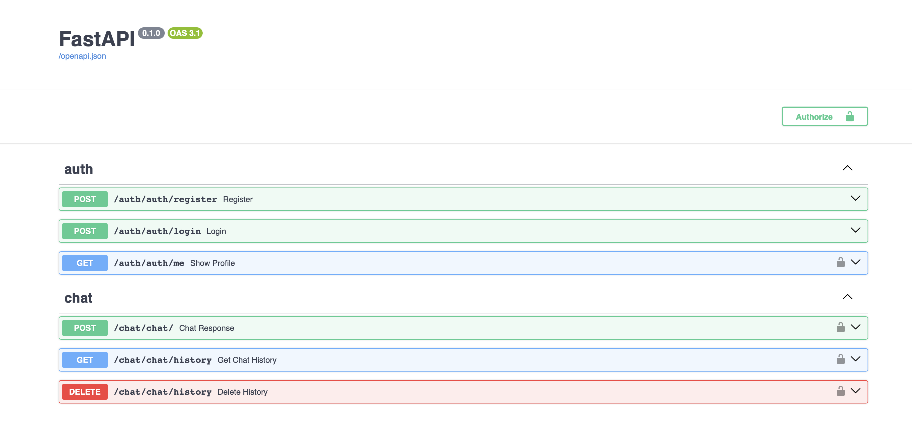
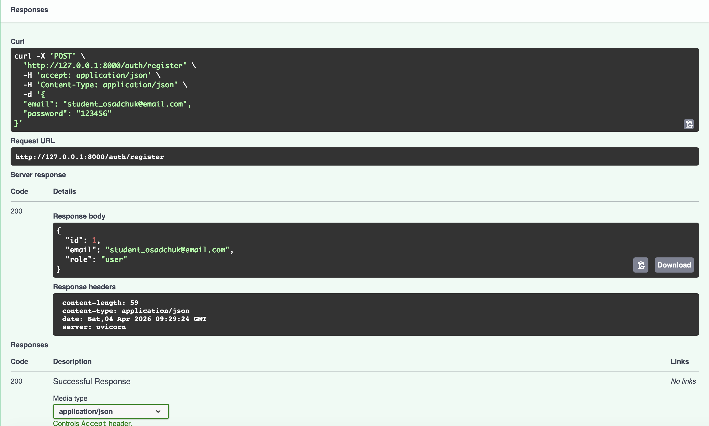
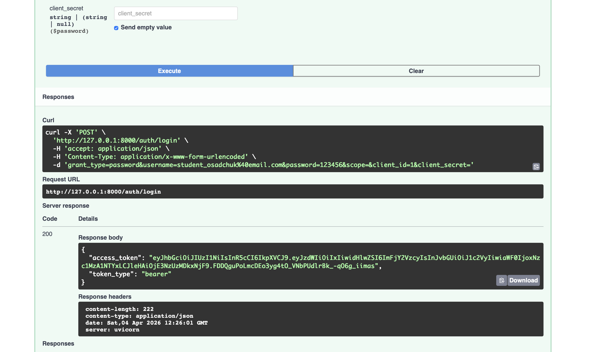
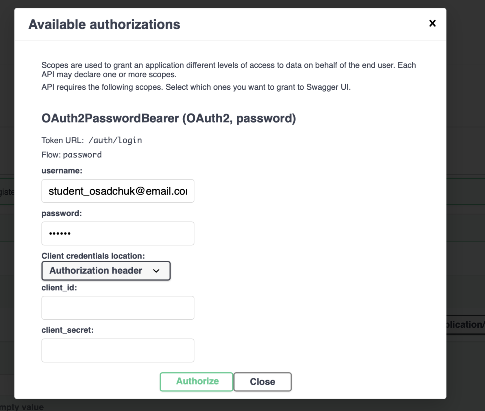
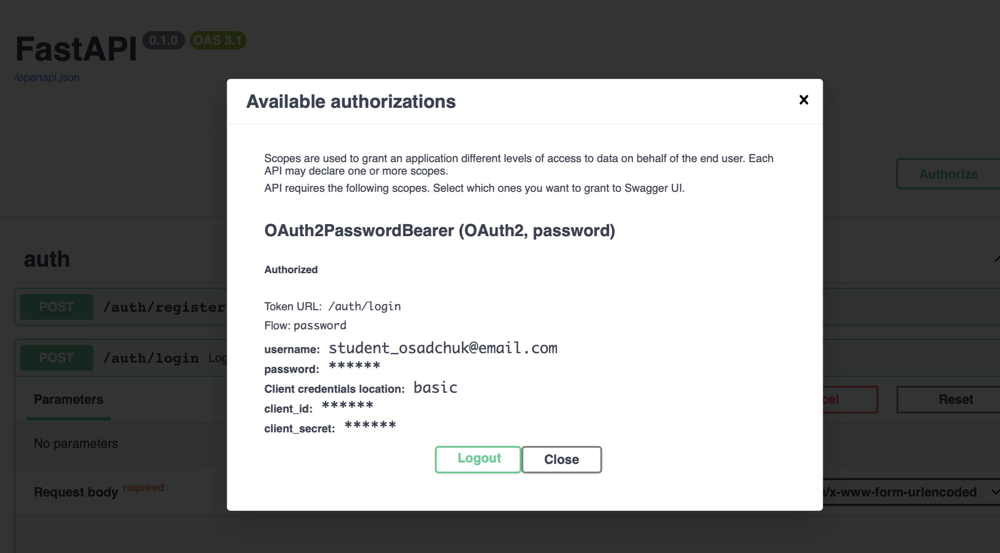
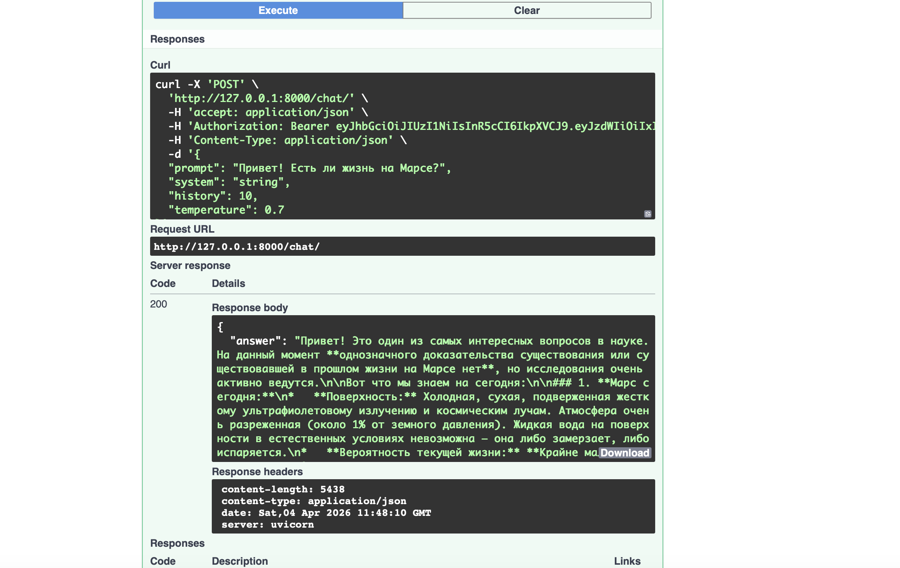
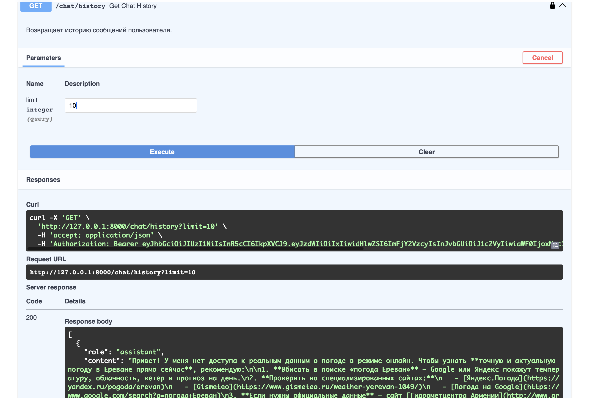
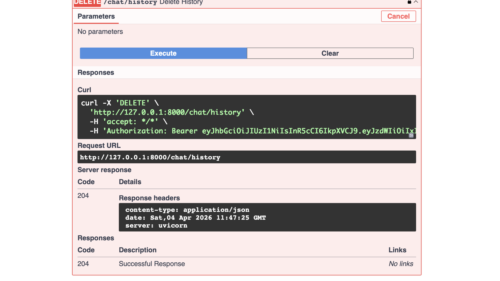

# LLM-P - FastAPI проект с интеграцией OpenRouter

## Описание

Проект представляет собой асинхронное FastAPI приложение с JWT-аутентификацией, хранением данных в SQLite и интеграцией с LLM через OpenRouter.

## Технологии

- FastAPI
- SQLAlchemy 2.0 (асинхронный)
- SQLite + aiosqlite
- JWT (PyJWT)
- Passlib + bcrypt
- OpenRouter API
- Uvicorn

## Установка и запуск

### 1. Клонировать репозиторий

Через SSH (требуется настроенный ключ):

```bash
git clone git@github.com:o-nastasia/llm-p.git
cd llm-p
```
или через HTTPS:

```bash
git clone https://github.com/o-nastasia/llm-p.git
cd llm-p
```

### 2. Установить зависимости

```bash
uv venv
source .venv/bin/activate
uv sync
```

### 3. Настроить переменные окружения

Создать файл `.env`по примеру .env.example и указать в нем свой реальный токен для `OPENROUTER_API_KEY`.

### 4. Запустить сервер

```bash
uv run uvicorn app.main:app
```

Swagger документация: `http://127.0.0.1:8000/docs`

## Эндпоинты

| Метод | Эндпоинт | Описание |
|-------|----------|----------|
| POST | `/auth/register` | Регистрация пользователя |
| POST | `/auth/login` | Получение JWT токена |
| GET | `/auth/me` | Профиль текущего пользователя |
| POST | `/chat/` | Отправить сообщение LLM |
| GET | `/chat/history` | История сообщений |
| DELETE | `/chat/history` | Очистить историю |

## Скриншоты

| Описание | Скриншот |
|----------|----------|
| Общий вид Swagger UI |  |
| Регистрация пользователя |  |
| Вход |  |
| Авторизация (форма ввода) |  |
| Авторизация (успешно) |  |
| Профиль пользователя |  |
| Отправка сообщения в чат |  |
| История сообщений |  |
| Удаление истории |  |
